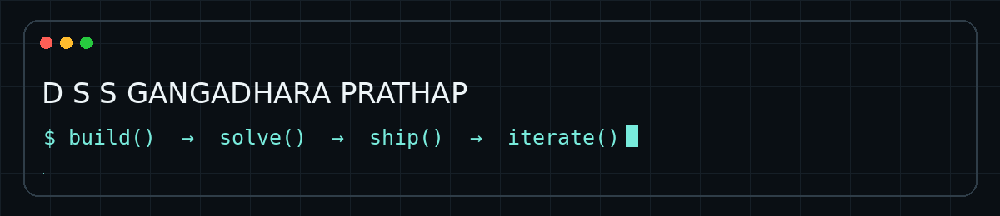
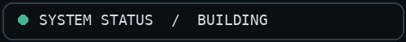
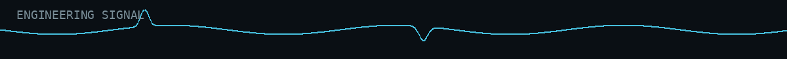

<div align="center">



### SOFTWARE • MOBILE • AI • SYSTEMS • VLSI

<p>
  <a href="https://github.com/GangadharPrathap"></a>
  <a href="https://www.linkedin.com/in/d-s-s-gangadhara-prathap-a6a556349/"></a>
  <a href="mailto:Gangadharprathap0606@gmail.com"></a>
</p>



**I build, experiment, and iterate across software and hardware — from web interfaces and mobile applications to Python problem solving, AI-oriented projects, and VLSI.**

</div>

---



## `01 / PROFILE`

I'm a developer who enjoys turning ideas into working products.

My public GitHub reflects a progression across **web → mobile → backend → Python → AI-oriented projects → problem solving**, alongside an academic focus in **Electronics & Communication Engineering and VLSI**.

I care about three things:

- **Build:** turn concepts into usable software.
- **Solve:** break ambiguous problems into executable steps.
- **Learn:** use every project to expand the engineering stack.

> **Current direction:** becoming the kind of engineer who can move from an idea and a problem statement to a working, polished implementation.

---

## `02 / WHAT I BUILD`

<table>
<tr>
<td width="25%" align="center">

### 🌐 WEB
React  
JavaScript  
HTML / CSS  
Backend fundamentals

</td>
<td width="25%" align="center">

### 📱 MOBILE
React Native  
JavaScript  
Cross-platform UI  
App development

</td>
<td width="25%" align="center">

### 🧠 AI / PYTHON
Python  
Problem solving  
AI-oriented projects  
Data / notebooks

</td>
<td width="25%" align="center">

### ⚡ HARDWARE
VLSI  
Digital design  
Electronics  
Systems thinking

</td>
</tr>
</table>

---

## `03 / SELECTED WORK`

### 🚀 [StartWise AI](https://github.com/GangadharPrathap/StartWise--AI)
**JavaScript · AI-oriented product**

An AI-oriented product project representing my current direction toward combining software engineering with AI.

### 🩺 [Health Report Analyser](https://github.com/GangadharPrathap/health-report-analyser)
**TypeScript · Health-tech**

A TypeScript project exploring structured health-report analysis and a user-facing workflow.

### 📱 [Mobile Development using React Native](https://github.com/GangadharPrathap/mobile-development-using-react-native)
**JavaScript · React Native**

Hands-on mobile development work focused on cross-platform application construction.

### 🧠 [Drift Point AI](https://github.com/GangadharPrathap/drift-point-ai)
**TypeScript · AI**

An AI-oriented TypeScript project representing experimentation beyond conventional frontend development.

### 💻 [LeetCode Problems](https://github.com/GangadharPrathap/leetcode-problems)
**Python · Algorithms / Problem Solving**

A continuously evolving collection of coding-problem solutions, demonstrating consistent algorithmic practice.

### 🌐 [Portfolio Website](https://github.com/GangadharPrathap/Portfolio-website)
**JavaScript · Web**

My personal portfolio implementation and an ongoing surface for presenting my work.

---

## `04 / ENGINEERING STACK`

### Languages
<p>


</p>

### Frameworks & Web
<p>


</p>

### Tools & Design
<p>


</p>

---

## `05 / PROBLEM SOLVING`

I maintain dedicated repositories for algorithmic practice across **LeetCode, CodeChef, Codeforces, and Python programming exercises**.

```text
PROBLEM
   ↓
UNDERSTAND
   ↓
DECOMPOSE
   ↓
DESIGN
   ↓
IMPLEMENT
   ↓
TEST
   ↓
OPTIMIZE
```

**Practice repositories**

- [LeetCode Problems](https://github.com/GangadharPrathap/leetcode-problems)
- [CodeChef Python](https://github.com/GangadharPrathap/codechef-python)
- [Python Programming Practice](https://github.com/GangadharPrathap/Python-programming-practice)
- [Python Loops Assignment](https://github.com/GangadharPrathap/python-loops-assignment)

---

## `06 / PROJECT LAB`

Not every repository needs to be a flagship project. Some repositories exist because **experimentation is part of engineering**.

<details>
<summary><b>Explore the wider project lab</b></summary>

<br>

| Repository | Area |
|---|---|
| [Habit-Tracker](https://github.com/GangadharPrathap/Habit-Tracker) | JavaScript / Web |
| [Backend](https://github.com/GangadharPrathap/Backend) | JavaScript / Backend |
| [Backend-files](https://github.com/GangadharPrathap/Backend-files) | JavaScript / Backend |
| [React-js](https://github.com/GangadharPrathap/React-js) | React / JavaScript |
| [Smartinterview](https://github.com/GangadharPrathap/Smartinterview) | Python |
| [MASAI-Assignments](https://github.com/GangadharPrathap/MASAI-Assignments) | Python / Jupyter |
| [Projects](https://github.com/GangadharPrathap/Projects) | Jupyter / Experiments |
| [trendpulse-GangadharPrathap](https://github.com/GangadharPrathap/trendpulse-GangadharPrathap) | Python |
| [Accenture-project-tasks](https://github.com/GangadharPrathap/Accenture-project-tasks) | Project / Internship work |
| [IITP AImLT Capstone](https://github.com/GangadharPrathap/iitp_aimlt_2601328-Capstone-project) | Jupyter / Capstone |
| [demo](https://github.com/GangadharPrathap/demo) | Assembly / Systems exploration |

</details>

---

## `07 / ENGINEERING JOURNEY`

```text
WEB
 │
 ├── HTML / CSS
 └── JavaScript
       │
       ▼
FRONTEND
 │
 └── React
       │
       ▼
MOBILE
 │
 └── React Native
       │
       ▼
BACKEND
 │
 └── JavaScript / server-side foundations
       │
       ▼
PYTHON
 │
 ├── Problem Solving
 ├── Coding Practice
 └── Data / Notebook Projects
       │
       ▼
AI / TYPESCRIPT
 │
 ├── StartWise AI
 ├── Drift Point AI
 └── Health Report Analyser
       │
       ▼
SYSTEMS THINKING
 │
 └── Electronics / VLSI
```

---

## `08 / CURRENTLY BUILDING`

<div align="center">

**Software Engineering × AI × Problem Solving × Systems Thinking**

</div>

The goal is not to collect technologies. It is to become better at taking a problem from:

`IDEA → ARCHITECTURE → IMPLEMENTATION → TESTING → DELIVERY`

---

## `09 / REPOSITORY PHILOSOPHY`

```text
01  Build things people can use.
02  Understand the problem before writing the solution.
03  Prefer clean systems over clever hacks.
04  Learn by shipping.
05  Keep improving the implementation.
```

---

## `10 / CONNECT`

<div align="center">

**Have a project, idea, or engineering problem worth discussing?**

<a href="https://www.linkedin.com/in/d-s-s-gangadhara-prathap-a6a556349/">

</a>
&nbsp;
<a href="mailto:Gangadharprathap0606@gmail.com">

</a>

<br><br>


<br>

<sub>Code. Create. Communicate. Contribute.</sub>

</div>
